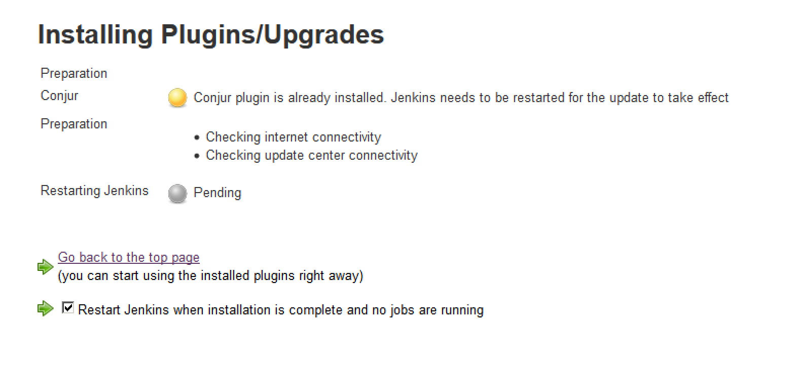
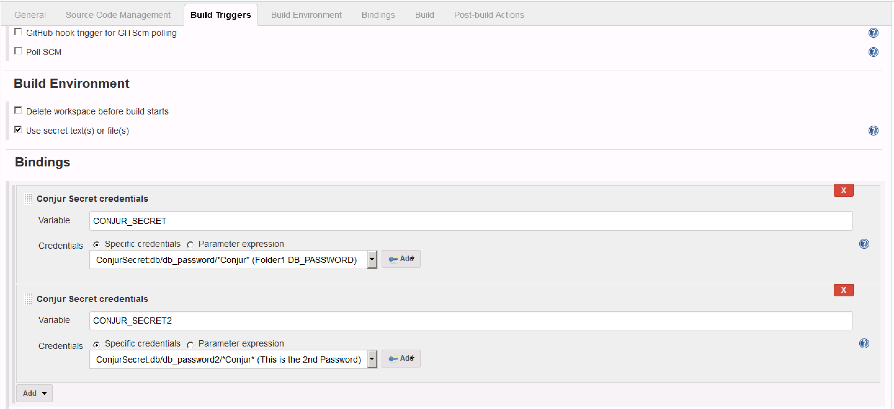

# conjur-credentials-plugin

This Conjur plugin securely provides credentials that are stored in Conjur to Jenkins jobs.  

## Installation

When you have the .hpi file, log into Jenkins as an administrator. Then go to **Jenkins** -> **Manage Jenkins** -> **Manage Plugins** -> **Advanced**.
In the **Upload Plugin** section, browse for the .hpi and upload it to Jenkins:


After installing the plugin, restart Jenkins:



## Usage

After installing the plugin and restarting Jenkins, you are ready to start.

### Conjur Login Credential

The first step is to store the credential required for Jenkins to connect to Conjur. Click the **Credentials** tab.

Define the credential as a standard "Username with password" credential. In the example below, the credentials are a Conjur host and its API key:

* **Username** is host/frontend/frontend-01. The host must already be defined as a host in Conjur policy.
* **Password** is the API key for that host. The API key is the value returned by Conjur when the host is loaded in policy.


### Global Configuration

A global configuration allows any job to use the configuration, unless a folder-level configuration overrides the global configuration. Click the **Global Credentials** tab.

 Define the Conjur Account and Appliance URL to use.


### Folder Property Configuration

To set the Conjur appliance information at the folder level, cLick the **FolderLevel** tab.

If the checkbox "Inherit from parent?" is checked, the values set here are ignored, and values are taken from the parent folder.  If all folders up the hierarchy are set to inherit from its parent, the global configuration is used.


Requests to Conjur will fail unless:

* An SSL certificate is specified in the SSL certificate field.
  **Note**: The SSL Certificate can be linked to a certificate already stored in Jenkins (defined as credentials).
* There is a certificate locally defined in the cacerts of the JVM sending the requests
* Conjur is not set up to use SSL.

### Conjur Secret Definition

The secrets that you want to obtain from Conjur must be defined explicitly. Use the **ConjurSecret** tab to define secrets. Define them as credentials of kind "Conjur Secret Credential".


### Usage from a Jenkins pipeline script

To reference Conjur secrets in a Jenkins script, use `withCredentials` and the symbol `conjurSecretCredential`.  
Here is an example showing how to fetch the secret from a Jenkins job pipeline definition.

```yml
node {
   stage('Work') {
      withCredentials([conjurSecretCredential(credentialsId: 'DB_PASSWORD', 
                                              variable: 'SECRET')]) {
         echo 'Hello World $SECRET'
      }
   }
   stage('Results') {
      echo 'Finished!'
   }
}
```

### Usage from a Jenkins Freestyle Project

To bind to Conjur secrets, use the option "Use secret text(s) or file(s)" in the "Build Environment" section of a Freestyle project.



Secrets are injected as environment variables to the build steps of the project.

## License

This repository is licensed under Apache License 2.0 - see [`LICENSE`](LICENSE) for more details.
